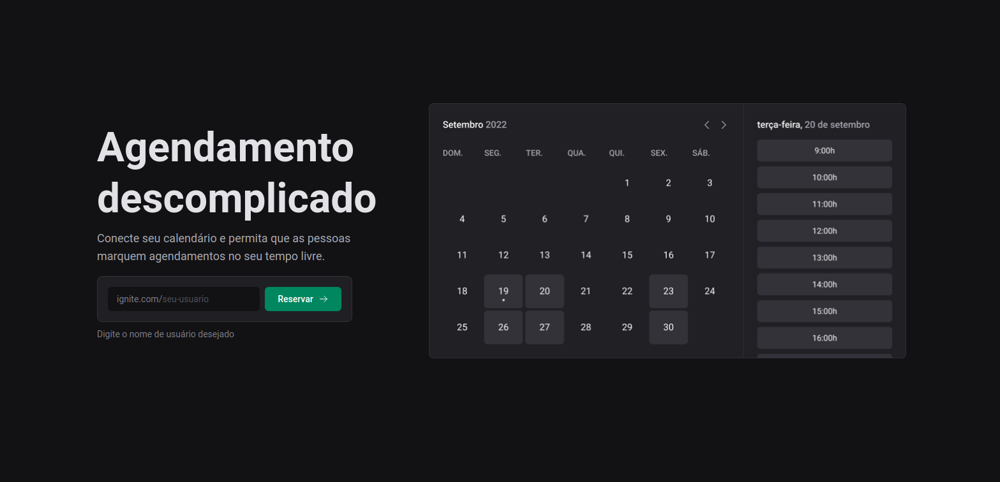
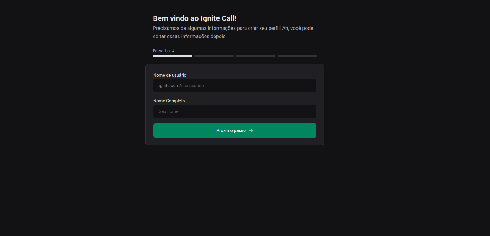
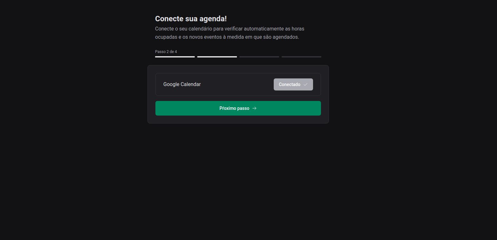
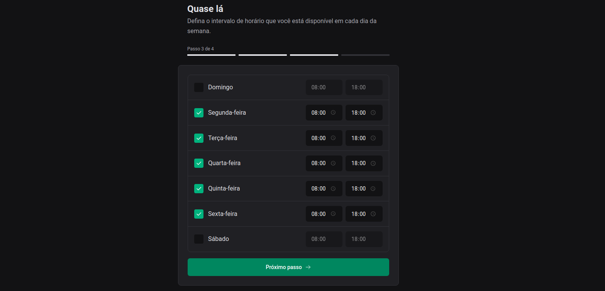
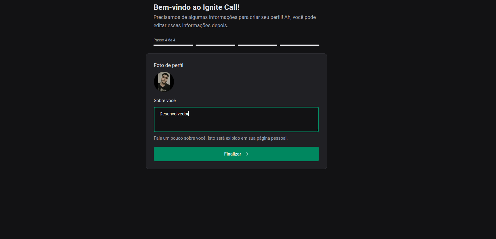
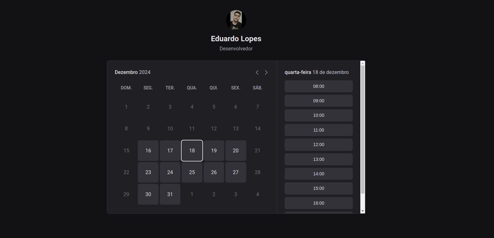
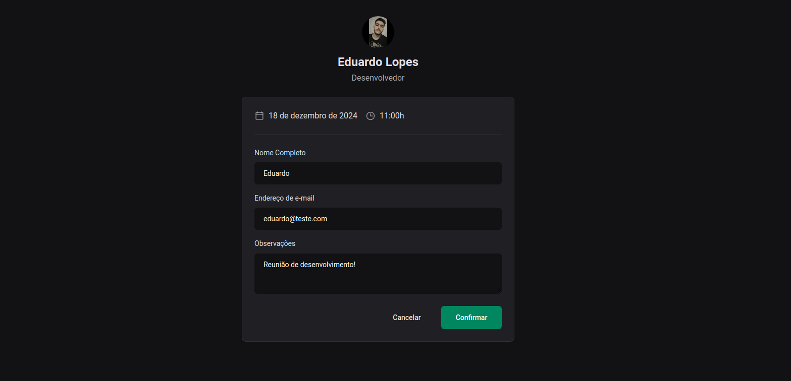

# 06-Ignite-call

## Conceitos Aprendidos

Neste projeto, tive a oportunidade de aprender e aplicar os seguintes conceitos:

- **Fundamentos do ReactJS**: compreensão dos principais conceitos do React, como componentes, estados e propriedades, para a construção de interfaces dinâmicas e reativas.
- **Criação de SPAs com ReactJS**: desenvolvimento de aplicações de página única (Single Page Applications) utilizando o React para navegação fluida sem recarregar a página.
- **Consumo de API e performance no ReactJS**: integração de APIs externas e otimização do desempenho da aplicação com estratégias de carregamento eficiente.
- **Fundamentos do Next.js**: utilização do framework para criação de aplicações web modernas e escaláveis, aproveitando funcionalidades como rotas automáticas e renderização híbrida.
- **Design System e Storybook**: criação de um sistema de design componetizado e documentação de componentes reutilizáveis utilizando o Storybook.
- **Criação de aplicação FullStack com NextJS**: desenvolvimento de uma aplicação completa, incluindo frontend, backend e integração com APIs, utilizando o Next.js.

## Imagens do Projeto

